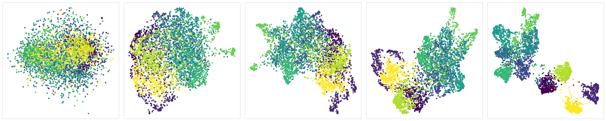
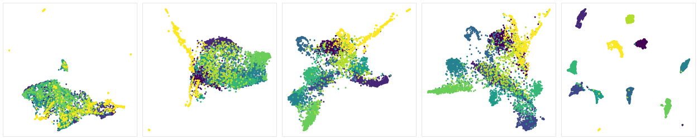
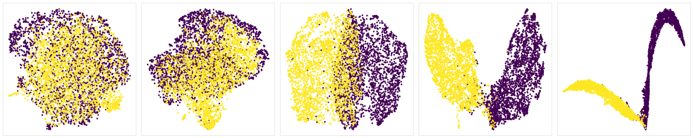

# LCC: Latent Cluster Correction


[](https://cedric.hothanh.fr/lcc/lcc.html)
[](https://choosealicense.com/licenses/mit/)
[](https://doi.org/10.5281/zenodo.14934702)
[](https://arxiv.org/abs/2501.11919)

- Neural networks take input samples and transform them into **latent
  representations**
- Semantically similar samples tend to aggregate into **latent clusters**
- This repository implements **Latent Cluster Correction**, a new technique to
  improve said latent clusters

## Pretty images

These are examples of input datasets fed into image classifier models. Some
selected latent representations are extracted and plotted in 2D (via
dimensionality reduction). Initially, during the feature extraction phase, the
samples are not clearly separated. But as the samples progressively get into the
classification phase, visible latent clusters emerge. The goal of LCC is to help
the formation of these clusters.

- [Resnet-18](https://huggingface.co/microsoft/resnet-18) on [CIFAR-10](https://huggingface.co/datasets/uoft-cs/cifar10):
  

- [VGG-11](https://huggingface.co/timm/vgg11.tv_in1k) on [EuroSAT](https://huggingface.co/datasets/timm/eurosat-rgb):
  

- [AlexNet](https://pytorch.org/vision/main/models/generated/torchvision.models.alexnet.html) on [Cats vs Dogs](https://huggingface.co/datasets/microsoft/cats_vs_dogs):
  

## Installation

Make sure [`uv`](https://docs.astral.sh/uv/) is installed. Then run

```sh
uv python install 3.10
uv sync --all-extras
```

## Usage

- Fine-tuning with LCC: modify and run `lcc.sh`, or use the CLI directly:

  ```sh
  uv run python -m lcc train --help
  ```

  For example:

  ```sh
  uv run python -m lcc train \
    microsoft/resnet-18 \
    PRESET:cifar100 \
    output_dir \
    --batch-size 256 \
    --head-name classifier.1 \
    --logit-key logits \
    --lcc-submodules resnet.encoder.stages.3 \
    --lcc-warmup 1 \
    --lcc-weight 0.01 \
    --seed 123
  ```

- Pretty-print a model structure from
  [HuggingFace](https://huggingface.co/models?pipeline_tag=image-classification):
  run `./pretty-print.sh HF_MODEL_NAME`, e.g.

  ```sh
  ./pretty-print.sh microsoft/resnet-18
  ```

## API overview

- [`lcc.training`](https://cedric.hothanh.fr/lcc/lcc/training.html): Training
  stuff
  - [`lcc.training.train`](https://cedric.hothanh.fr/lcc/lcc/training.html#train):
    Pulls and trains a model from the [HuggingFace model
    hub](https://huggingface.co/models?pipeline_tag=image-classification)
    (presumably pretrained on ImageNet) on a dataset also pulled from
    [HuggingFace](https://huggingface.co/datasets?task_categories=task_categories:image-classification).
    This method takes the model and dataset name as argument, so it's pretty
    rigid.
- [`lcc.datasets`](https://cedric.hothanh.fr/lcc/lcc/datasets.html): Dataset
  stuff

  - [`lcc.datasets.HuggingFaceDataset`](https://cedric.hothanh.fr/lcc/lcc/datasets.html#HuggingFaceDataset):
    A HuggingFace image classification dataset wrapped inside a [Lightning
    Datamodule](https://lightning.ai/docs/pytorch/stable/api/lightning.pytorch.core.LightningDataModule.html)
    for easy use with PyTorch Lightning.
  - [`lcc.datasets.get_dataset`](https://cedric.hothanh.fr/lcc/lcc/datasets.html#get_dataset):
    Creating a `HuggingFaceDataset` required a bunch of arguments. I was tired
    of copy-pasting them around, so I made this method to create classical
    datasets more quickly. See
    [`nlnas.datasets.DATASET_PRESETS_CONFIGURATIONS`](https://github.com/altaris/lcc/blob/728df7ef3124fba5c74343a528dfb8160822f3b7/lcc/datasets/preset.py#L10C30-L10C31)
    for the list of available presets.

- [`lcc.classifiers`](https://cedric.hothanh.fr/lcc/lcc/classifiers.html):
  Classifier models and wrappers
  - [`lcc.classifiers.HuggingFaceClassifier`](https://cedric.hothanh.fr/lcc/lcc/classifiers.html#HuggingFaceClassifier):
    A HuggingFace image classification model wrapped inside a [Lightning
    Module](https://lightning.ai/docs/pytorch/stable/api/lightning.pytorch.core.LightningModule.html)
    for easy use with PyTorch Lightning.
  - [`lcc.classifiers.TimmClassifier`](https://cedric.hothanh.fr/lcc/lcc/classifiers.html#TimmClassifier):
    Same but for [`timm` models](https://huggingface.co/docs/timm/index), which
    despite also coming from the Huggingface hub, require some special
    considerations. See also [`timm.list_models`](https://huggingface.co/docs/timm/reference/models#timm.list_models).
- [`lcc.correction`](https://cedric.hothanh.fr/lcc/lcc/correction.html): LCC
  stuff. You probably don't need to touch that directly since LCC is done
  automatically for classifier classes found in
  [`lcc.classifiers`](https://cedric.hothanh.fr/lcc/lcc/classifiers.html).
- [`lcc.plotting`](https://cedric.hothanh.fr/lcc/lcc/plotting.html): Cool
  plotting stuff.
  - [`lcc.plotting.class_scatter`](https://cedric.hothanh.fr/lcc/lcc/plotting.html#class_scatter):
    2D scatter plot where samples are colored by class. Also support "outliers",
    which are samples with negative label.

# Cite

- [Preprint](https://arxiv.org/abs/2501.11919)

  ```bibtex
  @misc{hothanhImprovingFineTuningLatent2025,
    title = {Improving {{Fine-Tuning}} with {{Latent Cluster Correction}}},
    author = {Ho Thanh, C{\'e}dric},
    year = {2025},
    month = jan,
    number = {arXiv:2501.11919},
    eprint = {2501.11919},
    primaryclass = {cs},
    publisher = {arXiv},
    doi = {10.48550/arXiv.2501.11919},
    urldate = {2025-01-22},
    archiveprefix = {arXiv},
    keywords = {Computer Science - Machine Learning},
  }
  ```

- Code

  ```bibtex
  @software{Ho_Thanh_LCC_Latent_Cluster_2025,
    author = {Ho Thanh, Cédric},
    license = {MIT},
    month = jan,
    title = {{LCC: Latent Cluster Correction}},
    url = {https://github.com/altaris/lcc},
    version = {1.0.0},
    year = {2025}
  }
  ```
